<h1 align="center">

Welcome to my Profile

</h1>

[//]: # ()

   

 

 
    

<h1 align="center">👤 About Me</h1>

     Hi!, currently studying for a Bachelor of Science in Information Technology

I have a strong passion for Backend development, Bitcoin, and Nostr use Kotlin as my primary language.

### 💬 Contact

- **Nostr**
    -   `lnwza007@rushmi0.win` (NIP-05)
    -  `npub1ujevvncwfe22hv6d2cjv6pqwqhkvwlcvge7vgm3vcn2max9tu03sgze8ry`

[//]: # (- 🎓 I'm currently studying Information Technology.)

### My Article

- [✨ โครงสร้าง UTxO](https://github.com/rushmi0/LaeliaX/blob/main/Test/Transaction/README.md)
- [✨ การสร้าง WIF](https://github.com/rushmi0/SecureKey/tree/main/src/main/kotlin/wif)

[//]: # ()

[//]: # (<ul>)

[//]: # (  <li>
🔗<a href="https://potofu.me/maybe515" rel="noopener noreferrer" target="_blank">POTOFU Account</a>
</li>)

[//]: # (  <li>
𝒂𝒏𝒅 𝒎𝒐𝒓𝒆...　🔗<a href="Self-Introductions.md">Self-Introductions.md</a>
</li>)

[//]: # (</ul>)

[//]: # ( )

 

[//]: # ()

<h1 align="center">🛠️ Language and Tools 💻</h1>

<table>
    <tr>
        <td align="center" width="98">
            
        </td>
        <td align="center" width="98">
            
        </td>
        <td align="center" width="98">
            
        </td>
        <td align="center" width="98">
            
        </td>
        <td align="center" width="98">
            
        </td>
        <td align="center" width="98">
            
        </td>
        <td align="center" width="98">
            
        </td>
    </tr>
    <tr>
        <td align="center" width="98">Kotlin</td>
        <td align="center" width="98">Rust</td>
        <td align="center" width="98">WASM</td>
        <td align="center" width="98">JavaScript</td>
        <td align="center" width="98">Java</td>
        <td align="center" width="98">C#</td>
        <td align="center" width="98">Python</td>
    </tr>
    <tr>
        <td align="center" width="98">
            
        </td>
        <td align="center" width="98">
            
        </td>
        <td align="center" width="">
            
        </td>
        <td align="center" width="98">
            
        </td>
        <td align="center" width="98">
            
        </td>
        <td align="center" width="98">
            
        </td>
        <td align="center" width="98">
            
        </td>
    </tr>
    <tr>
        <td align="center" width="98">Hyprland</td>
        <td align="center" width="98">Linux</td>
        <td align="center" width="98">Dioxus</td>
        <td align="center" width="98">Git</td>
        <td align="center" width="98">Action</td>
        <td align="center" width="98">Bash</td>
        <td align="center" width="98">Actix</td>
    </tr>
    <tr>
        <td align="center" width="98">
            
        </td>
        <td align="center" width="98">
            
        </td>
        <td align="center" width="98">
            
        </td>
        <td align="center" width="98">
            
        </td>
        <td align="center" width="98">
            
        </td>
        <td align="center" width="98">
            
        </td>
        <td align="center" width="98">
            
        </td>
    </tr>
    <tr>
        <td align="center" width="98">Docker</td>
        <td align="center" width="98">Android studio</td>
        <td align="center" width="98">Intellij Idea</td>
        <td align="center" width="98">PostresSQL</td>
        <td align="center" width="98">Action</td>
        <td align="center" width="98">Kitty</td>
        <td align="center" width="98">Cloudflare</td>
    </tr>
</table>

 
  
 
  

<h1 align="center">📌 Pin repo ⚡</h1>

 

 

<h1 align="center">📊 GitHub Analytics</h1>

  

  

    
    
   

    

